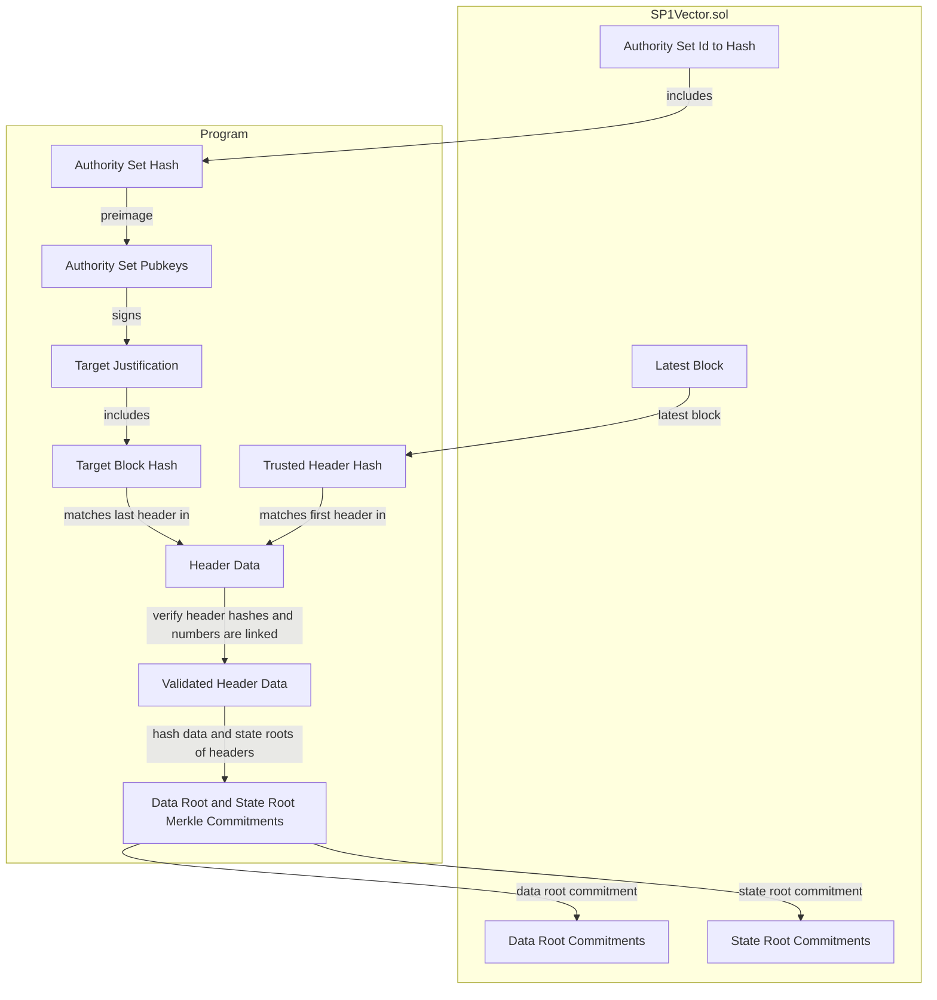
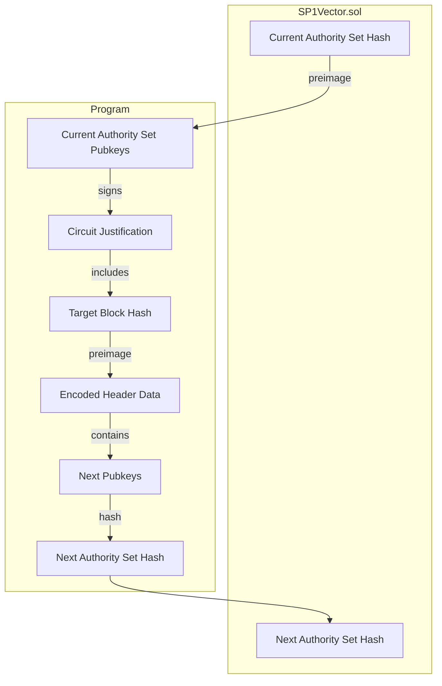

# Program Architecture

## Header Range

The header range program computes the data root and state root commitments for a range of headers. The program does the following:
1. The first header in the range is the trusted header (matching the `latestHeader` on the `SP1Vector.sol` contract when the proof is verified).
2. There exists a valid justification by an authority set in the `SP1Vector.sol` contract for the target block with an authority set id >= the authority set id of the trusted header.
3. The intermediate headers are linked in order by number and parent hash. Note: There is no way to produce a valid linked header range that does not match the real range as long as the justification on the target block is valid and the trusted header is also valid.
4. The authority set hash of the justification matches the authority set hash of the target block.

## Rotate

The rotate program computes the next authority set hash from the last header in an epoch signed by the current authority set. The program does the following:
1. The current authority set signed the justification for the target block.
2. The preimage of the target block hash which will be used for extracting the next validator set matches the target block hash signed in the justification.
3. Extract the next validator set from the epoch end header. In this process, validate that this epoch end header is valid.
4. Compute the next authority set hash from the next validator set.

